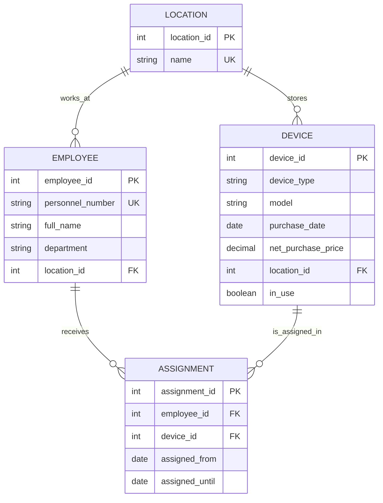

# Domänenmodell „Inventar“

## Mermaid ERD

### Fachregeln

**R1**  
Ein Gerät darf zu einem Zeitpunkt maximal eine aktive Zuweisung haben.

**R2**  
Eine Zuweisung ist aktiv, wenn `assigned_until` leer ist.

**R3**  
Zuweisungen für dasselbe Gerät dürfen sich zeitlich nicht überschneiden.

**R4**  
Das Enddatum (`assigned_until`) darf nicht vor dem Startdatum (`assigned_from`) liegen.

**R5**  
Der Netto-Kaufpreis eines Geräts darf nicht negativ sein.

**R6**  
Ein Gerät kann nur ausgeliehen werden, wenn es nicht bereits aktiv in Benutzung ist (`in_use = false`).

**R7**  
Nach Rückgabe eines Geräts (wenn `assigned_until` gesetzt wird), muss der Status `in_use` wieder auf `false` gesetzt werden.